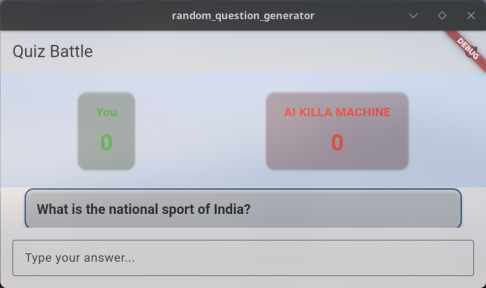
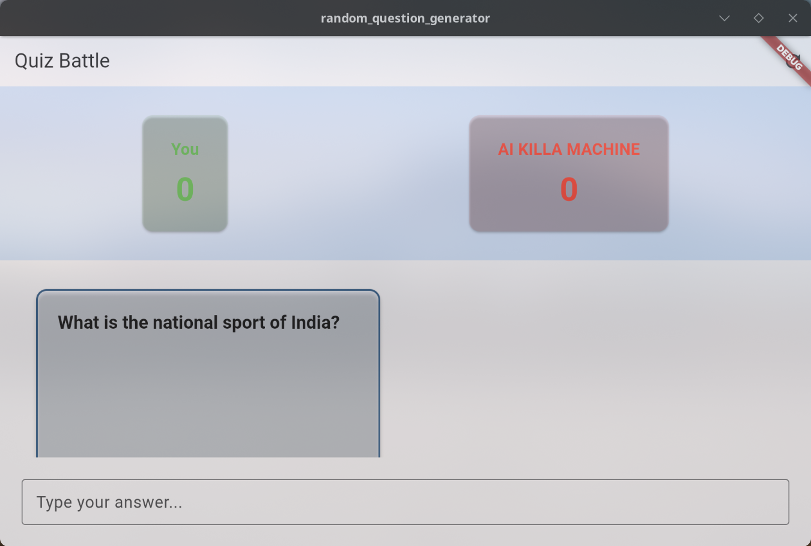
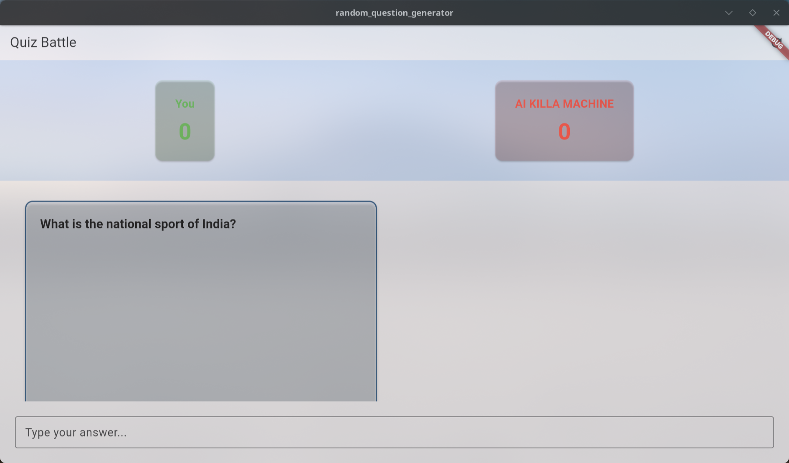
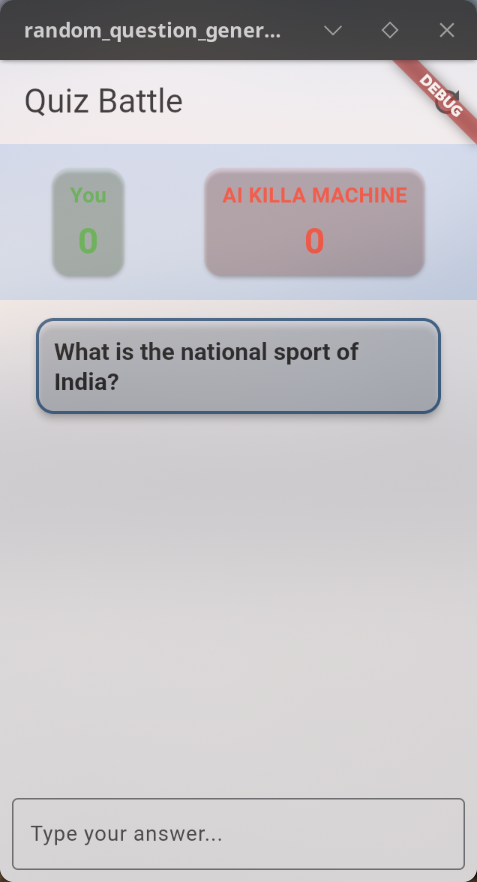
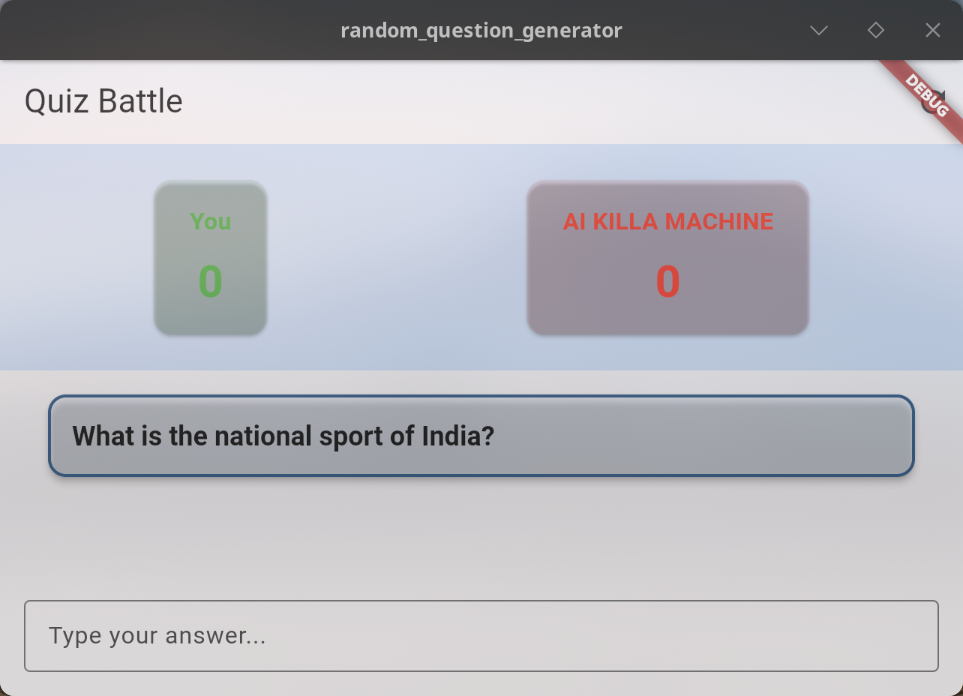
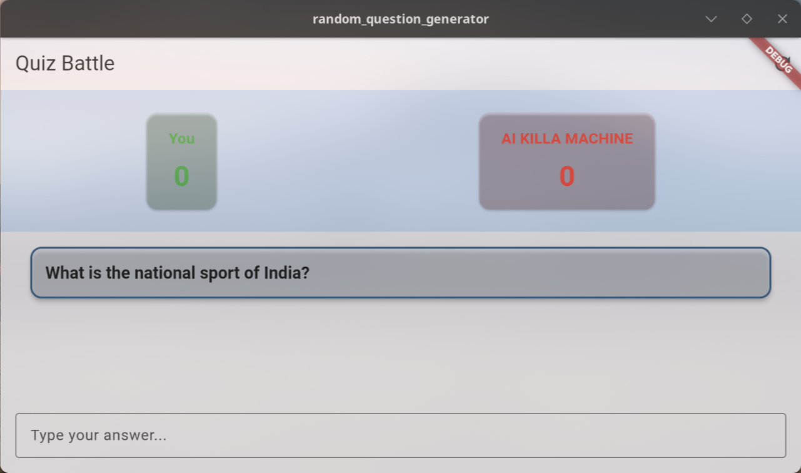

# Quiz Battle - Responsive Design Report

## Overview

Quiz Battle is a Flutter-based quiz game where users compete against an AI by answering questions correctly. The application features a responsive design that adapts to different screen sizes and orientations, providing an optimal user experience across various devices.

## Screenshots

### Portrait Mode

#### Mobile Device (Small Screen)

*Quiz Battle on a mobile device in portrait mode*

#### Tablet (Medium Screen)

*Quiz Battle on a tablet in portrait mode*

#### Desktop (Large Screen)

*Quiz Battle on a desktop in portrait mode*

### Landscape Mode

#### Mobile Device (Small Screen)

*Quiz Battle on a mobile device in landscape mode*

#### Tablet (Medium Screen)

*Quiz Battle on a tablet in landscape mode*

#### Desktop (Large Screen)

*Quiz Battle on a desktop in landscape mode*

## Responsive Layout Implementation

### Key Techniques Used

1. **OrientationBuilder**: Used to detect the current orientation of the device and adjust the layout accordingly.
   ```dart
   OrientationBuilder(
     builder: (context, orientation) {
       // Different layouts based on orientation
     }
   )
   ```

2. **LayoutBuilder**: Used to obtain the constraints of the parent widget, allowing for responsive sizing based on available space.
   ```dart
   LayoutBuilder(
     builder: (context, constraints) {
       final width = constraints.maxWidth;
       final height = constraints.maxHeight;
       // Responsive sizing based on available space
     }
   )
   ```

3. **MediaQuery**: Used to determine screen dimensions and adjust UI elements accordingly.
   ```dart
   final isSmallScreen = MediaQuery.of(context).size.width < 600;
   ```

4. **Flexible and Expanded Widgets**: Used to create layouts that adapt to different screen sizes.
   ```dart
   Expanded(
     child: // Content that fills available space
   )
   ```

5. **Conditional Rendering**: Used to show or hide UI elements based on screen size or orientation.
   ```dart
   if (orientation == Orientation.landscape && width > 900) {
     // Grid layout for landscape on larger screens
   } else {
     // List layout for portrait or smaller screens
   }
   ```

### Layout Adaptation

#### Portrait Mode
In portrait mode, the application uses a vertical layout with:
- Score cards at the top
- Questions displayed in a scrollable list
- Answer input field at the bottom

#### Landscape Mode
In landscape mode on larger screens (width > 900px), the application switches to a grid layout:
- Score cards remain at the top
- Questions are displayed in a grid with multiple columns
- Answer input field remains at the bottom

#### Small Screen Adaptation
On smaller screens (width < 600px):
- Reduced padding and spacing
- Simplified UI elements
- Optimized for touch interaction

## Widgets Used for Responsiveness

1. **GridView.builder**: Used for landscape mode on larger screens to display questions in a grid.
   ```dart
   GridView.builder(
     gridDelegate: SliverGridDelegateWithFixedCrossAxisCount(
       crossAxisCount: (width / 500).floor().clamp(2, 3),
       childAspectRatio: 1.5,
     ),
     // ...
   )
   ```

2. **ListView.builder**: Used for portrait mode or smaller screens to display questions in a list.
   ```dart
   ListView.builder(
     // ...
   )
   ```

3. **Card**: Used to display questions and scores with consistent styling.
   ```dart
   Card(
     // ...
   )
   ```

4. **TextField**: Used for answer input with appropriate sizing based on screen size.
   ```dart
   TextField(
     // ...
   )
   ```

## Conclusion

The Quiz Battle application successfully implements responsive design principles to provide an optimal user experience across various devices and orientations. By using Flutter's built-in responsive widgets and techniques like OrientationBuilder and LayoutBuilder, the application adapts its layout to different screen sizes and orientations, ensuring that users can enjoy the game regardless of their device.

The implementation demonstrates a good understanding of responsive design principles and Flutter's capabilities for creating adaptive user interfaces. 